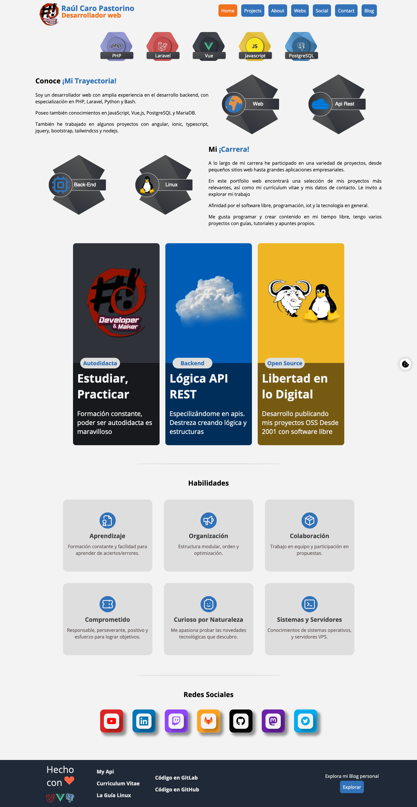
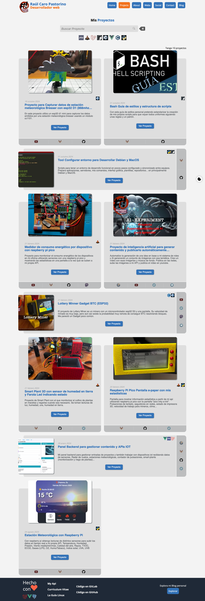
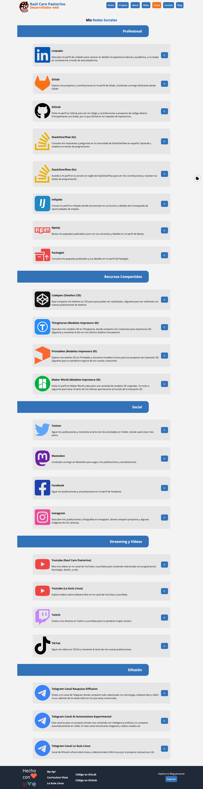
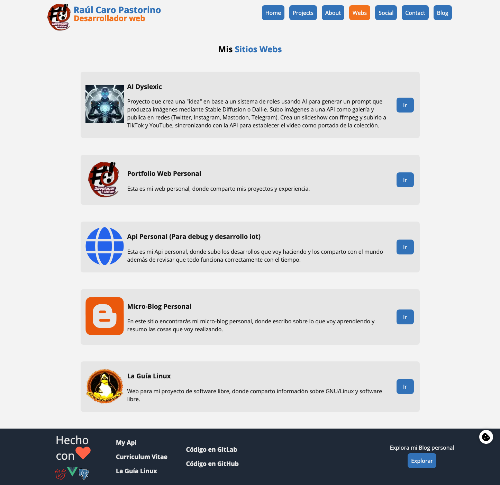
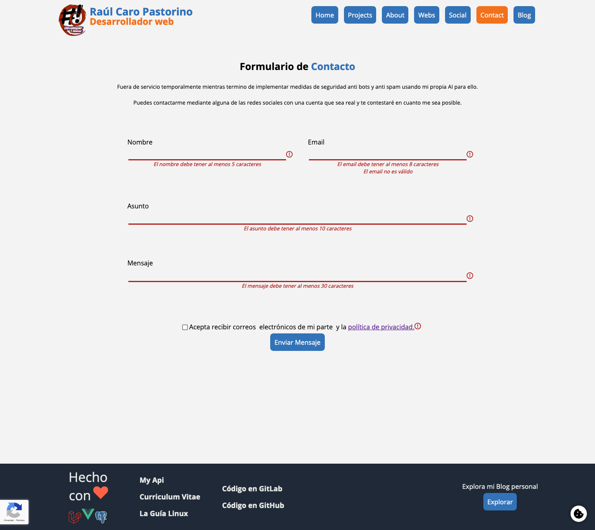

# Proyecto: Portfolio Personal en Nuxt 4 (Vue 3 + TypeScript)

> Portfolio web personal de **Raúl Caro Pastorino** ([@raupulus](https://github.com/raupulus)) — v1.1.0

Sitio web: [https://raupulus.dev](https://raupulus.dev)



Repositorio: [https://gitlab.com/raupulus/www.raupulus.dev](https://gitlab.com/raupulus/www.raupulus.dev)

## Stack Tecnológico

| Tecnología | Detalle |
|------------|---------|
| **Framework** | [Nuxt 4](https://nuxt.com/) (Vue 3, Composition API, `<script setup lang="ts">`) |
| **Lenguaje** | TypeScript (modo estricto) |
| **Estilos** | TailwindCSS 3 + design system "Silicon Architect" (tema oscuro, tokens Material Design 3) |
| **Generación** | Estática (SSG) con preset `static` de Nitro |
| **API Backend** | Laravel REST API en `api.raupulus.dev/api/v1` |
| **Testing** | Vitest + Vue Test Utils + happy-dom |
| **Linting** | ESLint + Prettier |
| **Analytics** | Google Analytics (nuxt-gtag) con control de cookies |
| **SEO** | Sitemap dinámico (`@nuxtjs/sitemap`), metatags Open Graph y Twitter Cards |
| **Imágenes** | `@nuxt/image` con IPX, lazy loading y formatos webp |

## Estructura del Proyecto

```
├── assets/css/          # Estilos globales, tema y variables CSS
├── components/          # Componentes Vue auto-importados
│   ├── app/             # Header, Footer (layout)
│   ├── btn/             # Botones reutilizables
│   ├── card/            # Tarjetas (proyecto, skill, vertical)
│   ├── content/blocks/  # Bloques de contenido EditorJS
│   ├── form/            # Componentes de formulario
│   ├── grid/            # Grids (proyectos, tecnologías)
│   ├── icons/           # Iconos SVG como componentes
│   └── modals/          # Componentes modales
├── composables/         # Lógica reutilizable (prefijo `use`)
├── docs/info/           # Documentación técnica de módulos
├── layouts/             # Layout principal (default)
├── middleware/          # Middleware global (scroll-to-top)
├── pages/               # Páginas y rutas
├── plugins/             # Plugins (Google reCAPTCHA)
├── public/              # Archivos estáticos
├── scripts/             # Scripts de despliegue
├── tests/               # Tests unitarios (Vitest)
├── types/               # Tipos TypeScript
└── utils/               # Utilidades (apiClient, sanitize, etc.)
```

## Páginas

| Ruta | Descripción |
|------|-------------|
| `/` | Página principal / Landing |
| `/projects` | Listado de proyectos |
| `/projects/:slug` | Detalle de proyecto |
| `/projects/:slug/:page` | Página de un proyecto |
| `/blog` | Blog (en construcción) |
| `/about` | Sobre mí + galería |
| `/webs` | Sitios web creados |
| `/social` | Redes sociales |
| `/contact` | Formulario de contacto |
| `/privacy` | Política de privacidad |

## Instalar dependencias

```bash
npm install
```

## Preparar variables de entorno

Este proyecto consume una API REST externa (Laravel) en `api.raupulus.dev`.

- **Desarrollo**: copiar `env.example` a `.env`
- **Producción**: copiar `env.example.production` a `.env`

```bash
cp env.example .env
```

## Iniciar servidor para desarrollar

El servidor de desarrollo se arranca en el puerto **3020** siendo accesible desde http://localhost:3020

```bash
npm run dev
```

## Generar contenido estático para producción (SSG)

Genera el sitio estático con SSG, incluyendo las rutas dinámicas de proyectos y el `sitemap.xml`.

```bash
npm run generate
```

## Previsualizar proyecto en producción

Permite generar y visualizar el proyecto localmente simulando el entorno de producción para detectar errores antes del despliegue.

```bash
npm run preview
```

## Calidad de código

```bash
# Verificar linting
npm run lint

# Corregir errores de linting automáticamente
npm run lint:fix

# Formatear código con Prettier
npm run format

# Verificar formato sin modificar
npm run format:check
```

## Tests

```bash
# Ejecutar tests en modo watch
npm run test

# Ejecutar tests una vez
npm run test:run

# Ejecutar tests con cobertura
npm run test:coverage
```

## Despliegue

El proyecto se despliega en un VPS propio usando **GoCD**.

### Pipeline GoCD

1. **lint** — Verifica calidad de código con ESLint.
2. **test** — Ejecuta tests unitarios con Vitest.
3. **build** — Genera el sitio estático con `npm run generate`.
4. **deploy** — (Aprobación manual) Despliega al VPS con rsync e incluye backup y rollback automático.

### Despliegue manual

```bash
./scripts/deploy.sh
```

El script realiza automáticamente:
- Backup del directorio actual.
- Generación del sitio estático.
- Despliegue con rsync.
- Verificación HTTP del resultado.
- Rollback automático si el despliegue falla.

## Documentación técnica

La documentación detallada de cada módulo del proyecto se encuentra en [`docs/info/`](docs/info/README.md). Es obligatorio mantenerla actualizada al modificar, crear o eliminar módulos.

## Galería

<p align="center">
  
  
  
  
</p>

## Licencia

Este proyecto está licenciado bajo la Licencia GPLv3. Consulta el archivo
[LICENSE](LICENSE) para más detalles.