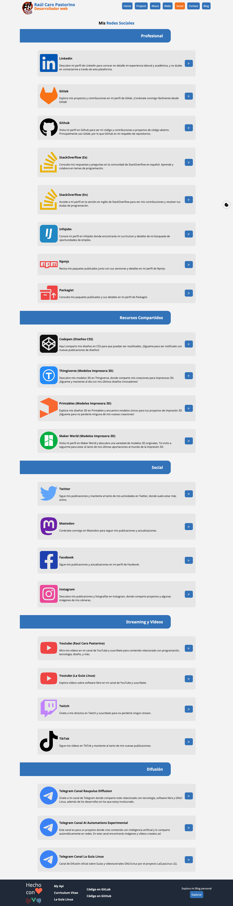

# Proyecto: Portfolio Personal en Nuxt 3 (vuejs)

Sitio web del autor y del proyecto: [https://raupulus.dev](https://raupulus.dev)


Repository [https://gitlab.com/raupulus/www.raupulus.dev](https://gitlab.com/raupulus/www.raupulus.dev)

## Instalar dependencias

```bash
# yarn
yarn install

# npm
npm install

# pnpm
pnpm install
```

## Preparar variables de entorno para api

Este proyecto depende de obtener la información a través de una api/backend que en mi
caso lo tengo creado en otro proyecto utilizando Laravel/php.

Para configurar el dominio y la api, hay que copiar el archivo **env.example.production** a .env y será cargado
automáticamente al ejecutarse (usa el env.example para desarrollar).

## Iniciar servidor para desarrollar

El servidor para desarrollar se arranca por defecto en el puerto **3000** siendo accesible desde http://localhost:3000

```bash
npm run dev
```

## Generar contenido estático para producción con SSR

Este comando generará el contenido estático preparado para SSR añadiendo también el sistema de rutas
para contenido dinámico (como por ejemplo proyectos) incluyendo esto también en el sitemap.xml.

```bash
npm run generate
```

## Previsualizar proyecto en producción

Con este comando podemos generar el proyecto y verlo localmente de modo que nos aseguramos
del pase a producción si tenemos que detectar errores o depurar algún problema que

```bash
npm run preview
```

## Galería

<p align="center">
  
  
  
  
</p>

## Licencia

Este proyecto está licenciado bajo la Licencia GPLv3. Consulta el archivo
LICENSE para más detalles.
